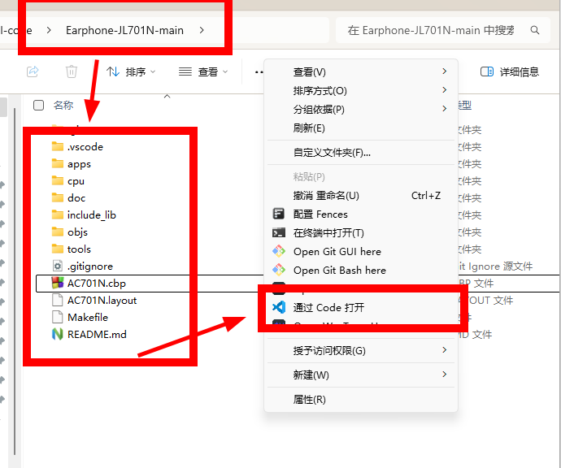
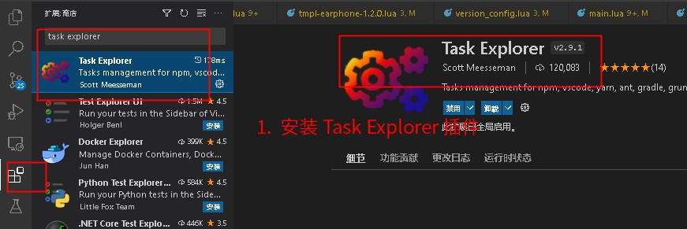
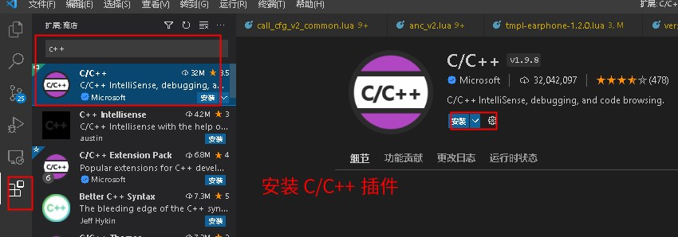
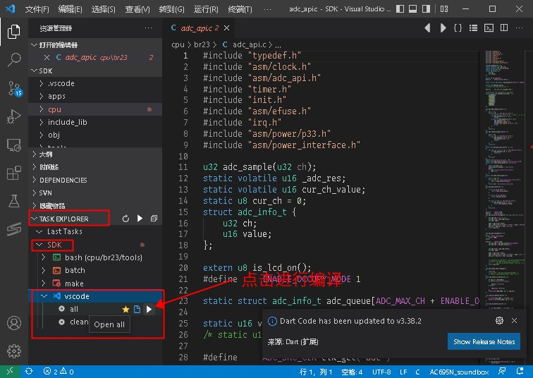
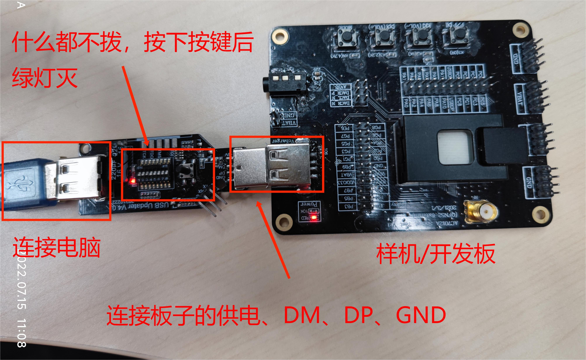
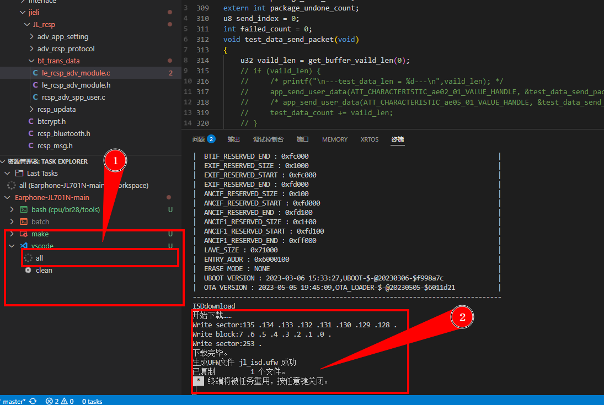

# Buddie-Firmware-JL701N


本仓库包含 Buddie AI 耳机的固件源码与技术文档，适用于基于杰理 AC701N 芯片的开发板。该固件方案专为**低功耗音频实时传输**设计，内置高效的音频压缩模块。

配合我们开源的手机端 AI 应用，可实现以下核心功能：

- 实时转录说话内容
- 通过耳机和AI助手进行语音交互
- 在线上会议转录我和其他人的说话内容


## 🛠 系统需求

- **操作系统:** Windows 10 及以上版本 (64位系统推荐)
- **硬件:** 
  - 杰理 AC701N 开发板
  - 强制下载工具
- **其他：**USB **数据线**（type-A） 

## 📚 准备工作

本项目，我们建议在 Windows 环境下使用 VSCode 进行编译。环境搭建过程如下：

1. [配置windows系统上的开发环境](#1-配置-Windows-开发环境)  
2. [VSCode上的开发环境](#2-使用-vscode-编译SDK)
3. [使用强制下载工具烧录固件](#3-使用强制下载工具烧录固件)

### 1 配置 Windows 开发环境

该 SDK 项目专为 **Windows 系统** 设计，默认使用 **Code::Blocks** 作为开发环境。

整个配置流程分为三个主要步骤：

1. **下载并安装 [Code::Blocks 的 Windows 版本](https://pkgman.jieliapp.com/s/codeblocks)**

2. **首次打开 Code::Blocks 并立即关闭**
   此操作将生成必要的配置文件，为后续开发做准备。

3. **下载并安装 [最新版本的杰理 Windows 工具链](https://pkgman.jieliapp.com/s/win-toolchain)**
   [点击此处下载]

完成以上步骤后，您就可以打开 Code::Blocks 项目，开始编译和开发工作。（推荐使用VSCode进行编译和开发工作）

如果需要更多的工具链和后处理工具，请参考： **[最新工具版本](https://doc.zh-jieli.com/Tools/zh-cn/other_info/index.html)**。

如需获取更详细的程序开发相关工具说明，请点击下方链接：  
https://doc.zh-jieli.com/Tools/zh-cn/dev_tools/dev_env/index.html

### 2 使用 VSCode 编译SDK

使用 VSCode 编译是通过调用 `make` 命令实现的。

#### 2.1 在SDK根目录下使用VSCode打开项目
<p align="center">
  
</p>


#### 2.2 安装必要的扩展插件：**Task Explorer** 和 **C/C++**

<p align="center">
  
</p>


<p align="center">
  
</p>


#### 2.3 选择对应的任务进行编译

点击 **TASK EXPLORER > SDK > vscode**，即可查看可用的任务列表：

- **all**：编译整个项目
- **clean**：清除编译输出文件

<p align="center">
  
</p>


### 3 使用强制下载工具烧录固件

#### 3.1 连接电脑和开发板

将强制下载工具的 USB 母口连接至电脑，USB 公口连接至原型板或开发板。
 （**注意：** 请勿连接反向，具体接法请参考下方图片。）

1. 具体操作步骤如下：
   1. 按照图片中的指引正确连接设备。
   2. 强制下载工具上的绿灯和红灯会开始闪烁。
   3. 按下强制下载工具上的按键——绿灯熄灭，红灯常亮。
   4. 此时即可将程序烧录到开发板上。

<p align="center">
  
</p>

**更多详细信息**，请参考：[**升级与下载说明**](https://doc.zh-jieli.com/Tools/zh-cn/dev_tools/forced_upgrade/upgrade_and_download.html)。

#### 3.2 烧录固件

在连接好电脑和开发板之后，按下强制下载工具上的按键。在强制下载工具上**绿灯熄灭，红灯常亮**的状态下，开始烧录。

1. 点击 [**all** task](#23-选择对应的任务进行编译) ，会自动执行编译和烧录任务

2. 当终端显示下载完毕生成UFW文件时，表示烧录完成。
3. 再次按下强制下载工具上的按键，绿灯和红灯会开始闪烁，开发板运行烧录的程序。


<p align="center">
  
</p>


--- 

## 🚀 入门指南

1.  **获取代码:**
    ```bash
    git clone https://github.com/你的用户名/你的仓库名.git
    cd 你的仓库名
    ```

2.  **编译与烧录固件:**
    *   打开 **杰理开发IDE**。
    *   在 IDE 中选择 `File` -> `Open Project` 或 `Import Project`，导航到 `git clone` 下来的仓库目录，选择项目文件 (通常是 `.prj` 或 `.uvprojx` 等，具体取决于IDE)。
    *   在 IDE 中选择正确的 **目标芯片型号 (AC701N)** 和 **烧录工具** (通常是软件模拟的 J-Link 或杰理专用烧录器)。
    *   确保开发板已连接且驱动安装正确，IDE 通常能自动识别到串口号。
    *   **编译项目：** 点击 IDE 中的编译按钮 (通常是 Build/Rebuild)。
    *   **烧录固件：** 编译成功后，点击 IDE 中的下载/烧录按钮 (通常是 Download/Flash)。观察 IDE 输出窗口，直到显示烧录成功。
    *   烧录完成后，开发板可能会自动复位运行新固件。

3.  **连接手机测试BLE数据接收:**
    *   在手机上安装一个通用的 BLE 调试工具 App (例如：`nRF Connect`, `LightBlue`, `BLE Scanner` 等)。
    *   打开 App，开始扫描附近的 BLE 设备。
    *   你应该能扫描到名为 **`JL701N_DEV`** (或您在代码中自定义的名称) 的设备。这是本基础固件默认的广播名称。
    *   点击连接该设备。
    *   连接成功后，尝试查找并订阅(Notify/Indicate) **数据接收特征值 (例如：`FFE1`)**。
    *   开发板固件默认可能会定时发送数据或回显手机发送的数据。请参考具体项目文档或代码注释了解数据格式和交互协议。
    *   观察 App 中是否成功接收到来自开发板的数据。

## 📖 文档

本仓库是基于杰理AC701N的固件代码进行开发的。因此文档将分为两部分：杰理官方文档和Buddie新增内容文档。

*   **杰理官方文档：**
    *   **AC701N 芯片 Datasheet:** 包含芯片的电气特性、引脚定义、功能模块等核心硬件信息。 *(通常包含在 SDK 包中或需从杰理获取)*
    *   **AC701N SDK 开发手册:** 详细说明 SDK 架构、API 接口、外设驱动、BLE 协议栈使用、开发流程等。 *(SDK 包中最重要的文档)*
    <!-- *   **杰理开发工具 (IDE) 用户手册:** 介绍 IDE 的使用方法、工程配置、编译、调试、烧录等功能。 *(通常包含在 IDE 安装包或 SDK 中)* -->
    *   *请查看仓库根目录下的 `doc` 文件夹获取详细的项目文档。*
    <!-- *   *请务必查阅您下载的 SDK 包内的 `doc` 或 `docs` 目录获取最准确和最新的官方文档。* -->

*   **Buddie新增内容文档：**
    *   **获取麦克风数据：**
    *   **获取扬声器数据：**
    *   **新建任务进程：**
    *   **数据处理及压缩：**
        *   **快速傅里叶变换：**
    *   **蓝牙数据发送：**
        *   **通过BLE进行发送数据：**
        *   **通过SPP进行发送数据：**
    *   **其他小功能：**
        *   **修改经典蓝牙/BLE广播名称：**
        *   **调整/锁定芯片主频：**
        *   **修改BLE characteristics：**

## 🧩 样例

本仓库的基础代码本身就是一个可运行的 BLE 示例。此外，我们还提供（或计划提供）以下基于此仓库修改的典型应用样例代码（可在仓库的 `examples` 目录中找到）：

1.  **修改广播名称:** 展示如何轻松更改设备的 BLE 广播名称。
    *   *修改位置:* `app_config.h` 或 BLE 初始化相关文件中的广播数据设置。
    *   *效果:* 手机扫描到的设备名称改变。

2.  **调整广播间隔:**
    *   *修改位置:* BLE 协议栈初始化或广播参数配置处。
    *   *效果:* 影响设备被发现的快慢和功耗。

3.  **自定义数据广播 (Beacon):** 实现类似 iBeacon/Eddystone 的广播帧，包含自定义信息（如 UUID, Major, Minor, TX Power 等）。
    *   *修改位置:* 配置广播数据包 (`advertising data` 和 `scan response data`)。
    *   *效果:* 设备无需连接即可广播特定信息，供手机 APP 扫描识别。

4.  **实现简单的数据透传:** 手机通过 BLE 发送数据，开发板接收后通过串口打印；开发板通过串口接收数据，再通过 BLE 发送给手机。
    *   *修改位置:* BLE 特征值的读写回调函数、串口接收中断服务程序。
    *   *效果:* 建立双向数据通道。

5.  **修改 BLE 发射功率:**
    *   *修改位置:* 调用设置 BLE 发射功率的 API。
    *   *效果:* 调整设备的无线通信距离。

## ❓ 问题与支持

如果您在使用本仓库或开发过程中遇到任何问题，请先查阅 **[FAQ](./docs/FAQ.md)** 和 **杰理官方文档**。

如果问题仍未解决，欢迎在仓库的 **[Issues](https://github.com/你的用户名/你的仓库名/issues)** 页面提交您的问题。请尽量清晰地描述问题现象、复现步骤、您已尝试过的解决方法以及相关的环境信息（如 SDK 版本、IDE 版本、开发板型号等）。

---

## 📜 许可证

本项目采用 **MIT 许可证** - 有关详细信息，请参阅 [LICENSE](LICENSE) 文件。

```plaintext
MIT License

Copyright (c) 2025 [您的姓名或组织名称]

特此免费授予任何获得本软件副本及相关文档文件（以下简称“软件”）的人士不受限制地处理本软件的权限，
包括但不限于使用、复制、修改、合并、发布、分发、再许可和/或销售本软件的副本，
并允许被提供本软件的人士这样做，但须符合以下条件：

上述版权声明和本许可声明应包含在本软件的所有副本或主要部分中。

本软件按“原样”提供，不提供任何明示或暗示的担保，包括但不限于对适销性、特定用途适用性和非侵权性的担保。
在任何情况下，作者或版权所有者均不对任何索赔、损害或其他责任承担责任，
无论是在合同、侵权或其他行为中产生的，还是与本软件或本软件的使用或其他交易相关的。
