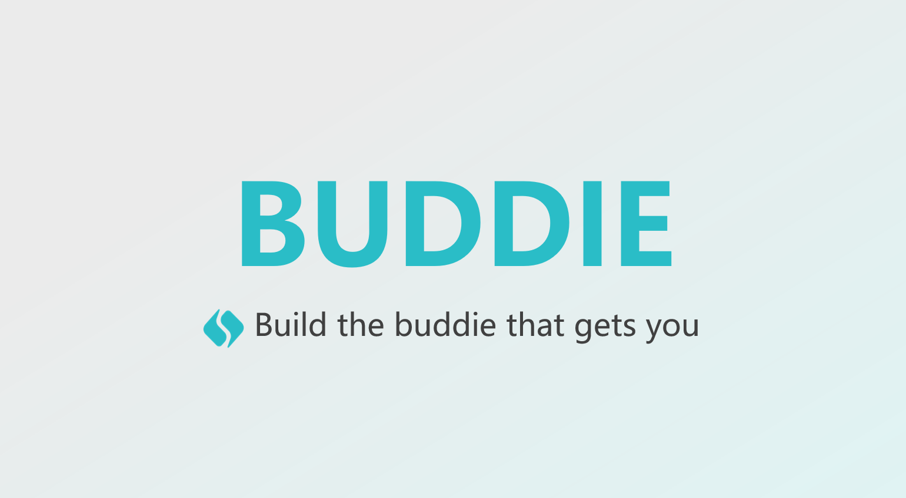
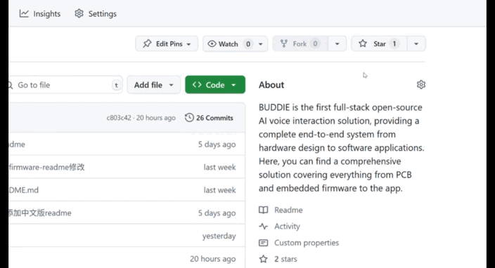

# 

  <a href="README.md">English</a> | <a href="README.zh_CN.md">简体中文</a>

  

# 🤖 BUDDIE.AI

## 🎯 Build the buddie that gets you. 

  <a href="https://bud.inc">Hello, Buddie</a> ·
  <a href="https://bud.inc">Documentation</a> ·
  <a href="https://discord.gg/hSDEbnqB">Buddie Disord</a>

  <!-- 
    如果你在访问 GitHub 仓库时看到 "repo not found"（仓库未找到），可能有以下几种原因：
    1. 仓库名称或路径拼写错误，请检查链接是否正确。
    2. 仓库被设置为私有，当前账号没有访问权限。
    3. 仓库已被删除或转移到其他组织/用户下。
    4. 你的网络环境（如中国大陆）可能被 GitHub 屏蔽或访问受限，建议尝试科学上网或更换网络环境。
    5. 账号未登录或登录状态异常，尝试重新登录 GitHub。
    6. 访问频率过高被 GitHub 暂时限制，稍后重试。

    解决方法：
    - 仔细检查仓库链接拼写。
    - 确认仓库是否为公开仓库，或联系仓库管理员获取访问权限。
    - 检查网络环境，必要时使用代理/VPN。
    - 登录正确的 GitHub 账号。
    - 仓库迁移后请查找新的仓库地址。
  -->
  
  </a>
  
  
  
  

<h2 align="center">🚀 Star our project to get notified of all updates first!</h2>

  

## What is BUDDIE 

BUDDIE is the first full-stack open-source AI voice interaction solution, providing a complete end-to-end system from hardware design to software applications. Here, you can find a comprehensive solution covering everything from PCB and embedded firmware to the app. Through this project, we aim to help everyone create their own personalized 24/7 voice companion—one that listens to what you listen to, thinks what you think, worries about what you worry about, grows with you, and explores the world together. Let the future of "Her" become reality.

  

  <a href="https://www.youtube.com/watch?v=ejEINaEQieY" target="_blank"><b>▶️ Watch the BUDDIE Demo Video</b></a>

<!-- 

  <iframe width="560" height="315" src="https://www.youtube.com/embed/ejEINaEQieY" title="BUDDIE Demo Video" frameborder="0" allow="accelerometer; autoplay; clipboard-write; encrypted-media; gyroscope; picture-in-picture; web-share" allowfullscreen style="display: block; margin: 0 auto;"></iframe>

 -->

## Features

### 🎧 **Smart Voice Mobile Application**
A complete AI voice interaction solution featuring open-source AI interaction logic and speech models, seamlessly integrated with embedded firmware data transmission for an all-in-one intelligent voice experience!
- **Open-Source AI Voice Engine:** Access and customize the core AI interaction logic and speech models to fit your unique application needs.
- **Seamless Embedded Integration:** Effortlessly connect with embedded firmware for real-time data exchange, enabling smooth communication between hardware and software.
- **End-to-End Voice Experience:** From voice capture to intelligent response, enjoy a unified and streamlined voice interaction process within a single platform.

### 📱 **Embedded Firmware Source Code**
A fully customized firmware for Jieli chips, integrating audio protocols, compression algorithms, and system control modules, perfectly matched with the PCB for effortless expansion and adaptation!
- **Comprehensive Audio Protocol Support:** Built-in support for a wide range of audio protocols, ensuring seamless compatibility with various audio devices and peripherals.
- **Advanced Compression Algorithms:** Efficient audio data compression for reduced latency and optimized storage, enabling high-quality voice interaction even on resource-constrained hardware.
- **Robust System Control Integration:** Deep integration with system control modules and PCB design, allowing for easy hardware expansion, flexible feature upgrades, and reliable performance across diverse application scenarios.

### 🌐 **Circuit Design Schematics**
Fully open-source PCB design! Circuit layouts, schematics, and BOM lists are all publicly available—enabling DIY assembly, rapid prototyping, and personalized development with complete freedom!

- **Modular Expansion Ready:** Easily customize and expand hardware features to suit your unique project requirements.
- **Comprehensive Documentation:** Step-by-step guides and detailed resources to support makers of all experience levels.

## Demo
BUDDIE currently develops separate demo platforms for software and hardware. The software is developed based on Flutter architecture, supporting both Android and iOS users. The hardware platform is designed based on the Jieli open platform. Specific demos can be found at the following links:

- If you want to learn more about the firmware, you can visit [here](Firmware-JL701N/README.md).

- If you want to learn more about the APP, you can visit [here](APP/README.md).

- If you want to learn more about the circuit, you can visit [here](PCB/README.md).

- If you want to learn more about function details, you can visit[here](https://bud.inc).

## Contributing
Calling all developers, hardware engineers, AI researchers, testers, tech writers and more! BUDDIE welcomes contributions across both software and hardware domains. Contributions of all types are more than welcome—read more in [contributions.md](contributions.md). If you are interested in contributing code, read our [contributions.md](contributions.md) and feel free to check out our GitHub issues to get started.

### 💻 **Software Contributions**
- **Flutter App Development**: Help improve our cross-platform mobile application
- **AI Voice Processing**: Contribute to voice recognition and natural language processing modules
- **Backend Services**: Enhance our cloud infrastructure and API services
- **UI/UX Design**: Create intuitive interfaces for better user experience

### 🔧 **Hardware Contributions**
- **Jieli Platform Development**: Contribute to our hardware platform based on Jieli open platform
- **Device Integration**: Help integrate BUDDIE with various IoT devices and wearables
- **Circuit Design**: Improve hardware schematics and PCB layouts
- **Embedded Programming**: Develop firmware for edge devices and companion hardware

### 🌍 **Community Contributions**
- **Documentation**: Help improve our technical documentation and user guides
- **Testing**: Participate in beta testing for both software and hardware components
- **Translation**: Support internationalization efforts for global accessibility
- **Content Creation**: Create tutorials, demos, and educational content

Before you start contributing, please make sure you have read and accepted our Contributor License Agreement. To indicate your agreement, simply edit this file and submit a pull request.

For bug reports, feature requests and other suggestions you can also create a new issue and choose the most appropriate template for your feedback.

Looking for other ways to contribute and wondering where to start? Check out the BUDDIE Ambassador program, we work closely with passionate community members and provide them with a wide range of support and resources including hardware development kits for qualified contributors.

If you have questions, you are welcome to contact us. One of the best places to get more info and learn more is in the BUDDIE Community where you can engage with other like-minded individuals working on the future of AI voice companions.

## Contributors

  

We welcome contributions from the community! Thank you to all the contributors who have helped make BUDDIE better.

## Contact

## 📬 Contact & Support

### 🏢 **Project Team**
- **Maintainer**: [MEMX BUDDIE Team](https://github.com/memx-life)
- **Email**: [public@memx.life](mailto:public@memx.life)

### 🌐 **Community & Resources**
- **Project Homepage**: [Hello, Buddie](https://bud.inc)
- **Documentation**: [get started here!](https://bud.inc)
- **Discord Server**: [Join our Discord](https://discord.gg/hSDEbnqB)

---

## 📄 License

This project is licensed under the **MIT License** - see the [LICENSE](LICENSE) file for details.

