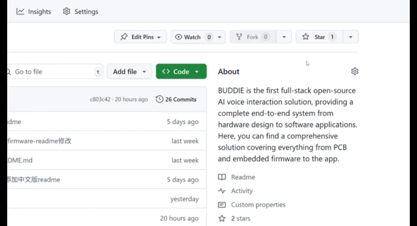

# 

  <a href="README.md">English</a> | <a href="README.zh_CN.md">简体中文</a>

  

# 🤖 BUDDIE.AI

## 🎯 打造真正懂你的 AI 伙伴

  <a href="https://bud.inc">你好，Buddie</a> ·
  <a href="https://bud.inc">文档</a> ·
  <a href="https://discord.gg/hSDEbnqB">Buddie Discord</a>

  
  
  
  
  

<h2 align="center">🚀 给我们的项目点星标，第一时间获取所有更新通知！</h2>

  

## 什么是 BUDDIE 

BUDDIE 是首个全栈开源 AI 语音交互解决方案，提供从硬件设计到软件应用的完整端到端系统。在这里，你可以找到涵盖从 PCB 和嵌入式固件到应用程序的全面解决方案。通过这个项目，我们旨在帮助每个人创建自己的个性化 24/7 语音伙伴——一个倾听你所听、思考你所想、担忧你所忧、与你一起成长、一起探索世界的伙伴。让《她》的未来成为现实。

  

  <a href="https://www.youtube.com/watch?v=ejEINaEQieY" target="_blank"><b>▶️ 观看 BUDDIE 演示视频</b></a>

<!-- 

  <iframe width="560" height="315" src="https://www.youtube.com/embed/ejEINaEQieY" title="BUDDIE Demo Video" frameborder="0" allow="accelerometer; autoplay; clipboard-write; encrypted-media; gyroscope; picture-in-picture; web-share" allowfullscreen style="display: block; margin: 0 auto;"></iframe>

 -->

## 功能特性

### 🎧 **智能语音移动应用**
完整的 AI 语音交互解决方案，包含开源 AI 交互逻辑和语音模型，与嵌入式固件数据传输无缝集成，提供一体化智能语音体验！
- **开源 AI 语音引擎：** 访问和定制核心 AI 交互逻辑和语音模型，以适应你独特的应用需求。
- **无缝嵌入式集成：** 轻松连接嵌入式固件进行实时数据交换，实现硬件和软件之间的流畅通信。
- **端到端语音体验：** 从语音捕获到智能响应，在单一平台内享受统一和流畅的语音交互过程。

### 📱 **嵌入式固件源代码**
专为 Jieli 芯片定制的完整固件，集成音频协议、压缩算法和系统控制模块，与 PCB 完美匹配，实现轻松扩展和适配！
- **全面的音频协议支持：** 内置支持广泛的音频协议，确保与各种音频设备和外设的无缝兼容性。
- **先进的压缩算法：** 高效的音频数据压缩，减少延迟并优化存储，即使在资源受限的硬件上也能实现高质量的语音交互。
- **强大的系统控制集成：** 与系统控制模块和 PCB 设计的深度集成，允许轻松的硬件扩展、灵活的功能升级，以及在不同应用场景下的可靠性能。

### 🌐 **电路设计原理图**
完全开源的 PCB 设计！电路布局、原理图和 BOM 清单全部公开可用——支持 DIY 组装、快速原型制作和个性化开发，拥有完全的自由度！

- **模块化扩展就绪：** 轻松定制和扩展硬件功能，以适应你独特的项目需求。
- **全面的文档：** 分步指南和详细资源，支持各种经验水平的创客。

## 演示
BUDDIE 目前为软件和硬件开发了独立的演示平台。软件基于 Flutter 架构开发，支持 Android 和 iOS 用户。硬件平台基于 Jieli 开源平台设计。具体演示可以在以下链接中找到：

- 如果你想了解更多关于固件的信息，可以访问[这里](Firmware-JL701N/README.md)。

- 如果你想了解更多关于 APP 的信息，可以访问[这里](APP/README.md)。

- 如果你想了解更多关于电路的信息，可以访问[这里](PCB/README.md)。

## 贡献
欢迎所有开发者、硬件工程师、AI 研究人员、测试人员、技术写作者等！BUDDIE 欢迎软件和硬件领域的各种贡献。所有类型的贡献都非常欢迎——更多信息请阅读 [contributions.md](contributions.md)。如果你对贡献代码感兴趣，请阅读我们的 [contributions.md](contributions.md)，并随时查看我们的 GitHub issues 开始参与。

### 💻 **软件贡献**
- **Flutter 应用开发：** 帮助改进我们的跨平台移动应用
- **AI 语音处理：** 为语音识别和自然语言处理模块做出贡献
- **后端服务：** 增强我们的云基础设施和 API 服务
- **UI/UX 设计：** 创建直观的界面以获得更好的用户体验

### 🔧 **硬件贡献**
- **Jieli 平台开发：** 为基于 Jieli 开源平台的硬件平台做出贡献
- **设备集成：** 帮助将 BUDDIE 与各种 IoT 设备和可穿戴设备集成
- **电路设计：** 改进硬件原理图和 PCB 布局
- **嵌入式编程：** 为边缘设备和配套硬件开发固件

### 🌍 **社区贡献**
- **文档：** 帮助改进我们的技术文档和用户指南
- **测试：** 参与软件和硬件组件的 beta 测试
- **翻译：** 支持国际化工作以实现全球可访问性
- **内容创作：** 创建教程、演示和教育内容

在开始贡献之前，请确保你已经阅读并接受了我们的贡献者许可协议。要表示你的同意，只需编辑此文件并提交拉取请求。

对于错误报告、功能请求和其他建议，你也可以创建一个新 issue 并选择最合适的模板来提供反馈。

寻找其他贡献方式并想知道从哪里开始？查看 BUDDIE 大使计划，我们与热情的社区成员密切合作，为合格的贡献者提供广泛的支持和资源，包括硬件开发套件。

如果你有疑问，欢迎联系我们。获取更多信息和了解更多的最佳场所之一是在 BUDDIE 社区，在那里你可以与志同道合的个人互动，共同致力于 AI 语音伙伴的未来。

## 贡献者

  

我们欢迎社区的贡献！感谢所有帮助让 BUDDIE 变得更好的贡献者。

## 联系方式

## 📬 联系与支持

### 🏢 **项目团队**
- **维护者：** [MEMX BUDDIE 团队](https://github.com/memx-life)
- **邮箱：** [public@memx.life](mailto:public@memx.life)

### 🌐 **社区与资源**
- **项目主页：** [你好，Buddie](https://bud.inc)
- **文档：** [从这里开始！](https://bud.inc)
- **Discord 服务器：** [加入我们的 Discord](https://discord.gg/hSDEbnqB)

---

## 📄 许可证

本项目采用 **MIT 许可证** - 详情请参阅 [LICENSE](LICENSE) 文件。

